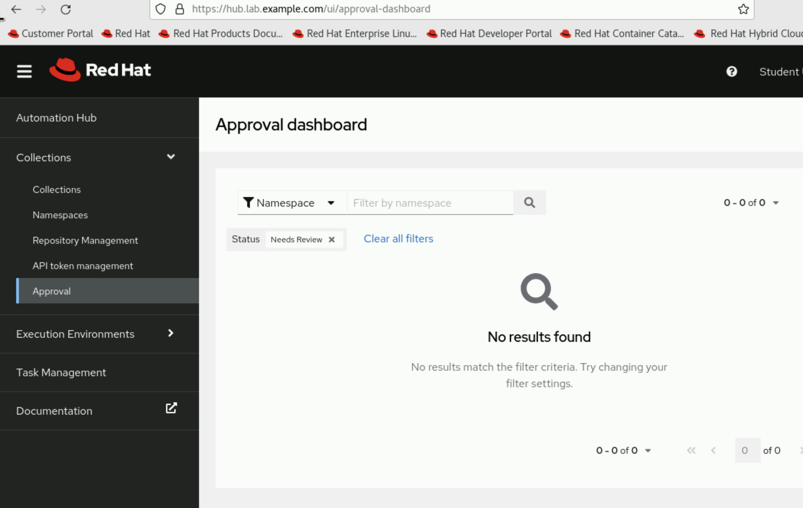

https://rol.redhat.com/rol/app/courses/do374-2.2/pages/ch09s02

```
ansible-galaxy collection init student.testcollection
cd student/testcollection
mkdir meta
```

meta/runtime.yml
```yaml
---
requires_ansible: '>=2.9.10'
```

`rm -vr docs roles/mymotd/{defaults,files,handlers,tests,vars}`

`ansible-galaxy collection build`

This will create a tarball that is uploaded to the collection server. 
You then need to go into the hub
1. Create namespace 'student'
2. Upload tarball
3. Click approval
   



You can then reference the collection in playbooks

```yaml
  roles:
    - role: student.testcollection.mymotd
```

## Dependencies

### OS Dependencies
- Use `bindep` (an openstack project) to install OS dependencies

## Deploying

See makefile


## Building

Note that if you are overwriting the iamge, you need to use podman not ansible-builder

cp Containerfile ee-build/context/Containerfile
podman build -f $(CONTEXT)/Containerfile -t $(REGISTRY)/review/$(IMAGE_NAME):v$$VERSION
