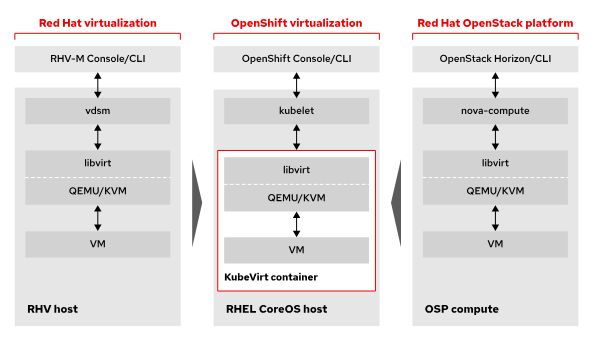

Openshift Virtualization Operator
HCO - Hyperconverged Operator
HPP - Hostpath Provisioner Operator
CNAO - Cluster Network Addons Operator
SSP - Scheduling, Scale, and Performance Opoerator
QEMU agent
KVM
CDI - Containerized Data Importer
