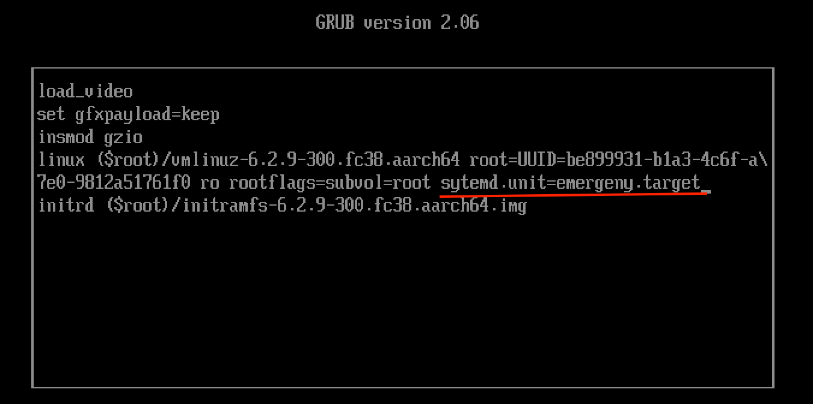

# Boot Process

https://rol.redhat.com/rol/app/courses/rh134-9.0/pages/ch10


## How machines boot

- POST initializes hardware
- UEFI firmware searches for a MBR on all disks
- Reads boot loader from disk and passes control of system to bootloader (GRUB2)
`/boot/efi/EFI/redhat/grubx64.efi`

Warning: Don't execute `grub2-install` on EFI system because it will regenerate grubx64.efi without signatures. 
You can restore the grubx64.efi by reinstalling the grub2-efi package

- Grub2 loads config from `/boot/grub2/grub.cfg` and `/etc/default/grub`
- bootloader loads kernel and `initramfs` from disk. 
  - `initramfs` image contains bootable root file system and systemd unit
  - `initramfs` image is configured using `/etc/cracut.conf.d/` using `dracut` and `lsinitrd`
- bootlader hands control over to kernel
- kernel executes `/sbin/init` from the `initramfs` image in memory (which is a link to systemd unit on rhel 9)
- systemd runs initramfs and pivots root filesystem to the /sysroot directory
- systemd unit rexecutes itself by running `/usr/lib/systemd/systemd` from the new root filesystem
- systemd looks for a default target


## Changing Grub

Grub loads config from

| bios| uefi |
|---| --- |
|  `/boot/grub2/grub.cfg` | `/boot/efi/EFI/redhat/grub.cfg` |

To configure grub, use `grub2-mkconfig` to genreate the configs.


# Targets

- graphical.target
- multi-user.target
- rescue.target
- emergency.target

systemctl list-dependencies graphical.target | grep target
systemctl list-units --type=target --all


### Set default target

```bash
systemctl get-default
systemctl set-default graphical.target
```

```bash
systemctl set-default multi-user.target
systemctl reboot
```

Change target with kernel command line in boot loader

`systemd.unit=rescue.target`



